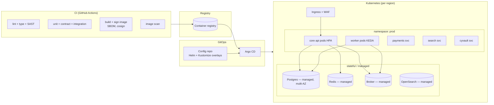

# Section C — Canonical Architecture Blueprint

> Cloud-native, multi-tenant, API-first. Evolves the existing Django + DRF + `platform/`
> core rather than rewriting it. Diagrams are textual (Mermaid) so they render in the repo
> and in Artifacts.

## C.0 Guiding principles

1. **Modular monolith first, services by necessity.** The core ships as one deployable Django project (apps behind one API gateway). Carve out an independent service only when a clear driver exists: independent scaling profile, hard compliance isolation, or a dedicated team. Day-1 carve-outs: **Identity**, **Payments/Billing**, **Search/Analytics read-model**, **Async workers**, **File/Media (CyVault)**. Everything else stays in the core.
2. **One canonical data model.** All flavors read/write the same entities (Section D). Flavor-specific fields live in typed extension tables or a constrained JSONB `attributes` column with a registered schema — never a forked model.
3. **Tenant isolation is non-negotiable and defence-in-depth.** App-layer queryset scoping **and** Postgres Row-Level Security (RLS) via session GUC, **and** per-tenant encryption context for sensitive columns.
4. **Events are the integration backbone.** Every state change emits a domain event to a transactional outbox → broker. Flavors, analytics, integrations, and the audit log all consume events; they do not reach into each other's tables.
5. **API-first.** No UI capability exists without a documented API behind it. REST for CRUD/commands, GraphQL for aggregation/read, webhooks + event stream for push.
6. **Zero-trust.** No implicit trust between services; every call carries a verifiable identity (OIDC/mTLS); least privilege; short-lived credentials; all access audited.

## C.1 Layered architecture

```mermaid
flowchart TB
  subgraph Clients
    WEB[Next.js 16 ERP Web]
    MOB[React Native Super App]
    PORT[Partner / Customer Portals]
    EXT[3rd-party API consumers]
  end

  subgraph Edge
    CDN[CDN / WAF]
    GW[API Gateway<br/>authN, rate-limit, routing, versioning]
  end

  subgraph Core["CyberCom Core (modular monolith + carved services)"]
    direction TB
    subgraph SharedPlatform["platform/ shared core"]
      IDN[Identity & SSO<br/>cyidentity + Keycloak]
      TEN[Tenant / Subscription / Licensing]
      PROV[Provisioning & Flavor Engine]
      EVT[Event Bus / Outbox]
      AUD[Audit & Compliance Log]
      NOT[Notifications]
      INTG[Integration Hub]
      OBS[Observability]
      AI[CyAI Assist]
    end
    subgraph Domain["Domain services (Django apps)"]
      CAT[Catalog & Pricing]
      ORD[Orders / Cart / Checkout / POS]
      INV[Inventory & Warehousing]
      FIN[Finance / GL / AR-AP / Invoicing / Tax]
      CRM[CRM]
      HR[HR / Payroll]
      SCH[Scheduling / Appointments]
      PROC[Procurement]
      ANL[Analytics read-model]
    end
    subgraph Flavors["Flavor packs (config + thin modules)"]
      FRET[RetailFlavour]
      FHOSP[HospitalityFlavour]
      FHLTH[HealthFlavour]
      FAUTO[AutoPartsFlavour]
      FJEW[JewelryCosmeticsFlavour]
      FGRO[GroceryHypermarketFlavour]
      FFUEL[FuelStationFlavour]
      FGOV[GovernmentPortalFlavour]
    end
  end

  subgraph CarvedServices["Independently deployed"]
    PAY[Payments & Billing svc]
    SRCH[Search / OpenSearch]
    FILES[CyVault file/media svc]
    WRK[Async workers / Celery]
  end

  subgraph DataStores
    PG[(PostgreSQL<br/>RLS, per-tenant schema opt.)]
    RED[(Redis)]
    OS[(OpenSearch)]
    OBJ[(Object store / CyVault)]
    DW[(Analytics warehouse)]
    BRK[(Event broker<br/>Kafka/Redpanda or SNS+SQS)]
  end

  subgraph Ecosystem
    PSP[PSPs: HyperPay / PayTabs / Moyasar / Tap / Stripe]
    DLV[Delivery: CyDrive / Talabat / Jahez / HungerStation]
    GOV[Gov: ZATCA Fatoora / NPHIES / Nafath / WPS]
    LAB[Labs / Pharmacies / Insurers]
    MKT[CyMart marketplace]
  end

  Clients --> CDN --> GW --> Core
  Domain <--> SharedPlatform
  Flavors --> Domain
  Core --> CarvedServices
  Core --> DataStores
  CarvedServices --> DataStores
  Domain --> BRK
  BRK --> ANL
  BRK --> AUD
  BRK --> INTG
  INTG --> Ecosystem
  PAY --> PSP
  ORD --> DLV
  FIN --> GOV
  FHLTH --> GOV
  FHLTH --> LAB
```



## C.2 Core platform services (what each owns)

| Service | Owns | Existing code | Change needed |
|---|---|---|---|
| **Identity & SSO** (`platform/cyidentity` + Keycloak) | realms, users, RBAC, MFA/WebAuthn, break-glass, OIDC issuance, cross-tenant federation (CyID), consent grants | present; federation phases 3–10 in `D:\cybercom` | consolidate CyShop's own JWT auth into this; finish cyshop/cycom federation wiring; make CyID the single issuer |
| **Tenant / Subscription** (`platform/tenant`) | tenant metadata, subscription tiers, licensing, entitlements, SSO config, compliance flags, **data-residency region** | present (26 models) | add `residency_region`, `flavor_set`, per-tenant encryption key ref |
| **Provisioning & Flavor Engine** (`platform/provisioning`) | industry templates, dept/country packs, blueprint→provision, AI-propose, **flavor composition** | present | promote to first-class "flavor" concept: a flavor = module set + layout templates + tax/reg presets + workflows + KPI dashboards + seed data; support **multiple flavors per tenant** |
| **Catalog & Pricing** | products, variants, SKUs, categories, kits/BOM, price lists, promotions, **weight/rate-based pricing**, fitment data | CyCom `catalog` (ported from CyShop), tested | extend attribute model for jewelry (karat/purity/making-charge), auto (fitment/OE-xref/supersession), grocery (PLU/weighed) |
| **Orders / POS / Checkout** | cart, order lifecycle + state machine, POS sessions, payments capture, **KDS**, receipts, layaway, discount approval, returns | CyCom `pos` + `sales`; CyMart `cart`/`orders` | unify CyMart order lifecycle with CyCom POS orders under one Order aggregate; offline-first POS client |
| **Inventory & Warehousing** | stock items + valuation, moves, internal/transfer orders, multi-location, batch/serial/expiry, replenishment | CyCom `inventory`, present | add lot/expiry surfacing for grocery/pharma; multi-branch availability API |
| **Finance / GL / Invoicing / Tax** | chart of accounts, journal posting, AR/AP, invoices, multi-currency + rate table, **tax engine + ZATCA Phase 2 clearance**, bank recon, statements | CyCom `accounting` + `ar_ap`; reports + base-currency conversion done | **build ZATCA Phase 2** (XML invoice, QR, Fatoora clearance API, cryptographic stamp); tax-rule presets per country/vertical |
| **CRM** | leads, opportunities, pipeline, activities, campaigns | CyCom `crm` — pipeline + activities added | UI; loyalty hooks for retail/grocery |
| **HR / Payroll** | employees, contracts, leave, attendance, payroll runs, **GOSI / gratuity / GPSSA / WPS** | CyCom `hr` + `payroll`; JO/SA/UAE coded | confirm 2 flagged rates; WPS file generation; more GCC countries |
| **Scheduling / Appointments** | resources, calendars, bookings, reminders, no-show handling | CyCom `scheduler`; CyMed `clinic` | promote to shared service; used by Health (patient visits), Auto (service bays), Hospitality (spa/tables) |
| **Procurement** | purchase requests → PO → goods receipt, approvals, supplier catalogs, rebates | CyCom `procurement`, present | supplier-catalog ingestion; rebate/margin mgmt for grocery |
| **Integration Hub** (`platform/cyintegrationhub`) | connector framework, credential vault, retry/DLQ, webhook delivery, partner API keys | present | connectors: PSPs, delivery aggregators, Fatoora, NPHIES, Nafath, WPS banks, accounting exports |
| **Analytics** | event-sourced read model, dashboards, cross-domain reporting, KPI packs per flavor | CyCom `cyai_reports`/`cyai_analytics` | dedicated warehouse + read-model service; per-flavor KPI dashboards |
| **Events / Outbox** (`platform/events`) | transactional outbox, domain event schema registry, replay | present | AsyncAPI schema registry; broker upgrade (see C.6) |
| **Audit & Compliance** (`platform/audit`) | immutable audit log, access log, consent ledger, data-subject requests | present | PDPL DSAR workflow; tamper-evident storage |
| **CyAI Assist** (`platform/cyai`) | onboarding AI-propose, in-app assistant, report NL query | present (ModelGateway flagged simulated) | wire a real model gateway; governance per `docs/ai/` |
| **Payments & Billing** (carved) | PSP abstraction, tokenisation, subscription billing, invoicing for the platform itself, refunds/disputes, settlement | CyMart `payments`/`settlement`; Stripe webhook HMAC in `D:\cybercom` | carve into its own service (PCI scope isolation); one seam, many PSPs |
| **CyVault** (carved) | object/media storage, DICOM archive, presigned access, retention | present, deploy pipeline exists | back all file needs (catalog images, invoice PDFs, patient imaging, KYC docs) |

## C.3 Flavor-template architecture (the key idea)

A **flavor** is a declarative package, not code fork:

```yaml
flavor: AutoPartsFlavour
extends: RetailFlavour            # flavors can compose
modules: [catalog, inventory, orders, pos, finance, procurement, crm]
catalog_profile: auto_parts       # enables fitment / OE-xref / supersession attributes
layout_templates:                 # per-screen UI composition (design-system slots)
  - counter_sale
  - parts_lookup_by_vehicle
  - multi_branch_availability
workflows:
  - core_charge_handling
  - warranty_return
tax_presets: { country: SA, profile: b2b_standard_vat }
kpi_dashboard: auto_parts_pack     # GMROI, fill rate, dead stock, counter conversion
integrations: [supplier_catalog_feed]
seed_data: auto_parts_demo
regulatory: [zatca_phase2]
```

- **Provisioning engine** composes one or more flavors onto a tenant at onboarding and can add a flavor later (clinic adds RetailFlavour for its pharmacy shop).
- **Layout templates** map to slots in the design system — the same components, arranged per vertical. No bespoke frontends.
- **Attribute profiles** switch on typed extension fields in Catalog/Inventory/Order without schema forks.
- **KPI packs** are saved analytics queries + dashboard layouts.
- Flavor definitions are versioned, reviewed by the flavor-governance board (Section F), and shipped independently of core releases behind feature flags.

Wave 1 flavors: **RetailFlavour, HospitalityFlavour, HealthFlavour**. Wave 2: **AutoPartsFlavour, GroceryHypermarketFlavour**. Wave 3: **JewelryCosmeticsFlavour, FuelStationFlavour, GovernmentPortalFlavour**.

## C.4 API surface

| Style | Use | Standard |
|---|---|---|
| **REST** (`/api/v1/...`) | resource CRUD, commands (`POST /orders/{id}/confirm`) | OpenAPI 3.1, DRF + drf-spectacular; existing `/api/schema/swagger-ui/` |
| **GraphQL** (`/graphql`) | cross-entity read, aggregation, mobile/portal composition | schema-first, persisted queries only in prod; existing Graphene in cyshop → migrate to Strawberry on core |
| **Webhooks** | push to customer/partner endpoints | signed (HMAC-SHA256), at-least-once, replayable, per-event-type subscription |
| **Event stream** | partner/analytics consumers | AsyncAPI-described, per-tenant topic filtering, consumer offset mgmt |

**Versioning:** URL-major (`/api/v1`, `/api/v2`) + `Sunset`/`Deprecation` headers; two majors supported concurrently; contract tests gate every release; breaking changes only at major bumps, min 6-month deprecation window.

**Developer portal:** auto-published OpenAPI + AsyncAPI, interactive console, sandbox tenant provisioning, API-key + OAuth2 client management (self-serve), rate-limit tiers, changelog, connector SDKs (Python, TS). Built on `platform/api` + `cyintegrationhub`.

## C.5 Security architecture (zero-trust)

| Control | Implementation |
|---|---|
| **Identity** | OIDC via Keycloak/CyIdentity; every user + service has an identity; no shared secrets between services; workload identity via mTLS (service mesh) or signed JWT with short TTL |
| **AuthZ** | RBAC in `cyidentity` (roles → permissions), tenant-scoped; attribute/policy checks for cross-tenant (consent grants); default-deny |
| **MFA/SSO** | TOTP + WebAuthn built; enterprise SSO (SAML/OIDC federation) per tenant; step-up auth for high-risk actions (payroll run, refund, patient data export) |
| **Tenant isolation** | (1) app queryset scoping `TenantScopedModelViewSet`; (2) Postgres RLS `SET app.current_tenant`; (3) per-tenant KMS data key for PII/PHI columns; (4) object-store prefix isolation + signed URLs |
| **Encryption** | TLS 1.3 in transit everywhere incl. internal; AES-256 at rest (DB, object store, backups); field-level encryption for national ID/Iqama/IBAN/PHI; KMS-managed keys, per-tenant DEK, annual rotation |
| **Secrets** | external secret manager (Vault / cloud KMS); no secrets in env files, images, or git; CI pulls at deploy; `dev-auth` shim hard-blocked when `DEBUG=False` |
| **Audit** | immutable append-only log for auth, data access, config change, financial posting, PHI access; tamper-evident (hash chain); 7-year retention for financial, per-regulation for health |
| **Threat modelling** | STRIDE per service at design; documented in `docs/security/THREAT_MODEL.md` (exists — extend per service); reviewed each major |
| **Testing** | SAST + dependency scan in CI (cymed has `security-scan.yml` — extend to all); DAST on staging; annual external pentest; bug-bounty after GA |
| **Data residency** | tenant `residency_region` pins DB shard, object store bucket, and backup region; cross-border transfer blocked at the data layer for regulated categories (PDPL) |

## C.6 Deployment blueprint



- **Cloud:** primary **AWS `me-central-1` (UAE)** + **`me-south-1` (Bahrain)** for Gulf residency; **KSA** workloads on a sovereign option (AWS KSA region / Google Cloud Dammam / Oracle Jeddah) as PDPL and customer contracts require. Jordan pilot can start in `me-south-1`.
- **Orchestration:** Kubernetes (EKS). Managed Postgres (RDS/Aurora), Redis (ElastiCache), broker (MSK or Redpanda Cloud), search (OpenSearch Service), object store (S3 → CyVault abstraction).
- **Release strategy:** GitOps (Argo CD) from a config repo; **blue/green** for the core API; **canary** (5% → 25% → 100%, automated rollback on SLO breach) for risky changes; **feature flags** (OpenFeature + a flag service) decouple deploy from release and gate flavors.
- **DB migrations:** expand/contract pattern — additive migration → deploy code that tolerates old+new → backfill → contract migration next release. Never a breaking migration in the same deploy as the code that needs it. Per-tenant migration orchestration for large backfills.
- **Multi-region:** active-active not required at launch; **active (Gulf) + warm standby**, async DB replication, RPO ≤ 5 min, RTO ≤ 1 h. Region is a hard boundary for regulated tenants (no failover across residency lines).
- **Environments:** dev → staging (prod-like, seeded) → prod; ephemeral PR preview envs for the frontend; a permanent **sandbox** tenant pool for the developer portal.

## C.7 Observability

| Pillar | Tooling | What |
|---|---|---|
| Metrics | Prometheus + Grafana (or Managed) | RED per endpoint, per-tenant request rate, queue depth, DB pool, event lag, PSP success rate, ZATCA clearance latency |
| Traces | OpenTelemetry → Tempo/Jaeger | end-to-end incl. gateway → core → PSP/gov-portal; trace-id in every log and API response header |
| Logs | structured JSON → Loki/OpenSearch | correlation id, tenant id (hashed), user id (hashed); PII scrubbed at source |
| SLOs | per critical journey | checkout success ≥ 99.5%, POS ring latency p95 < 400 ms, signup→provision < 90 s p95, invoice clearance < 10 s p95 |
| Alerting | Alertmanager → PagerDuty/Opsgenie | burn-rate alerts on SLOs; synthetic probes for checkout, POS, signup, clearance |
| Runbooks | `docs/operations/PRODUCTION_RUNBOOK.md` (exists — extend) | one per alert; incident severity matrix; on-call rotation; blameless postmortem template |
| Business observability | analytics read-model | provisioning throughput, activation rate, churn signals, per-flavor adoption |

## C.8 What to build vs reuse (net-new effort)

| Net-new | Reuse / evolve |
|---|---|
| ZATCA Phase 2 clearance engine | CyCom accounting/GL, catalog, POS+KDS, inventory, procurement, provisioning |
| Flavor engine (promote provisioning to multi-flavor) | `platform/` identity, tenant, events, audit, notifications, integration hub |
| Payments service carve-out + PCI isolation | CyMart payment abstraction + Stripe webhook verify |
| Event broker upgrade + AsyncAPI registry | existing outbox pattern |
| Analytics warehouse + read-model service | cyai_reports queries |
| Developer portal | `platform/api` + drf-spectacular schema |
| Offline-first POS client | existing POS backend |
| RTL/Arabic i18n workstream | `LocaleDirection` foundation |
| CyShop → core auth/tenant consolidation | CyShop catalog/POS value (already ported) |
| K8s + GitOps platform | existing Dockerfiles + compose + CI workflows |
